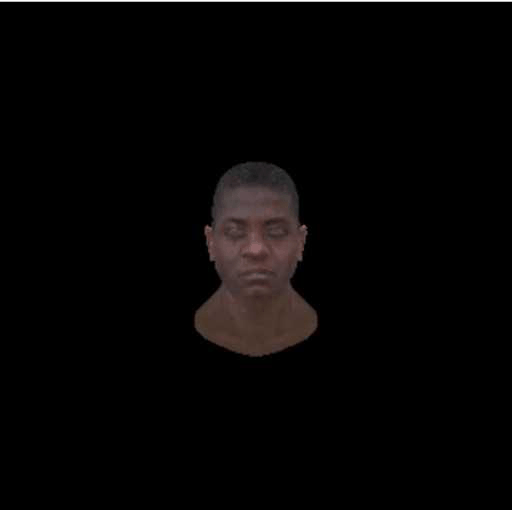

## **本节目标**
1. 根据光照（Phone模型），实现平行光，点光源和聚光灯

## **准备工作**

## **工作开始**
### **标准光照模型（Phone模型）
### **环境光**
### **漫反射**
### **镜面高光**
### **平行光**
### **点光源**
### **聚光灯**

## **进阶学习**
### **1. 法线矩阵修正
### **2. 聚光灯边缘软化**
